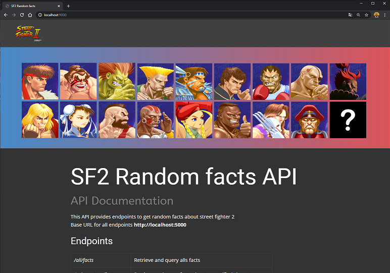

# Flask API on Docker with PostgreSql 

Dockerizing a local REST API builded on Flask <br>This API provides endpoints to get random facts about one of my favourite games... 🕹️ STREET FIGHTER II

## Features
- Docker
- Docker Compose
- Python / Flask
- Gunicorn
- SQLAlchemy
- PostgreSQL
- A website for API's documentation and usage, created with Nicepage and Docker (Nginx image)

## Setup

Clone, build and run it with docker
```bash
git clone https://github.com/kenybapin/docker-flask-api.git
cd docker-flask-api
docker-compose up -d --build
```
## Getting started
Base URL for all endpoints
```bash
http://docker_host_ip:5000
```
Website URL and documentation
```bash
http://docker_host_ip:9000
```

## API documentation
### Endpoints

###### GET
| Endpoint | Description |
|---|---|
| /all/facts | Retrieve and query alls facts |
| /***character***/facts | Retrieve and query facts about a specified character |
| /random/facts | Retrieve query facts about a random character |

###### POST
| Endpoint | Description |
|---|---|
| /***character***/facts | Post facts about a character with var. "mytext" |
| /***character***/facts | Retrieve and query facts about a specified character<br>example : curl -X POST http://localhost:5000/honda/facts -d "mytext=this is my fact" |

### Models

###### Char
| key | type | description |
|---|---|---|
| id | Integer | Unique ID for the Character |
| name | String | Character's name |

###### Facts
| key | type | description |
|---|---|---|
| id | Integer | Unique ID for the Fact |
| char_id | Integer | ForeignKey related to Character.id |
| text | String | The Fact itself |
| char | Nona | relationship reference to characters table |


## Future etensions
- Try factoring code and remove unused libraries.
- Add users on facts with auth (name, email, token)
- Display Facts dynamically on website (HTML/CSS/jQuery) ==> bring "Pop-up" text to each character.
- Fix broken links from website with docker host ip.

**website (work in progress)**<br>

